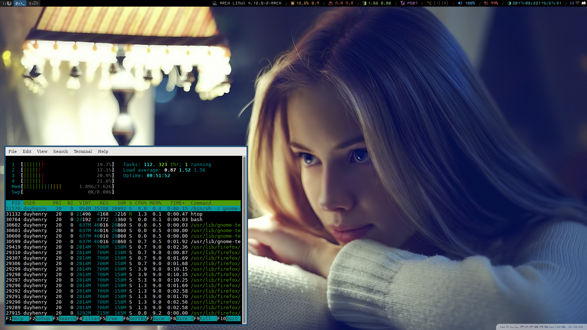

<h1 align="center">
	
	 
	 
</h1>

Arch Linux private dotfiles, for backup purpose

## Setup
- Dictionary : `goldendict`  
- Application Launcher: `rofi` + `Xrescources`
- Shell: `bash`
- Terminal Emulator: `urxvt`
- Text Editor: `vim`
- Music Player: `ncmpcpp` + `mpd`
- Web Browser: `Firefox`
- Video Player: `vlc`
- Zsh Terminal: `zsh`
- Thinkfan of Lenovo Thinkpab T430 : `thinkfan.conf`
- other: `tmux.conf`, `fonts`

### Other dotfiles
- [i3wm-config](https://github.com/duyhenryer/i3wm-config)

#### Misc
- [x] Contact me: [Telegram](https://t.me/duyhenryer)

